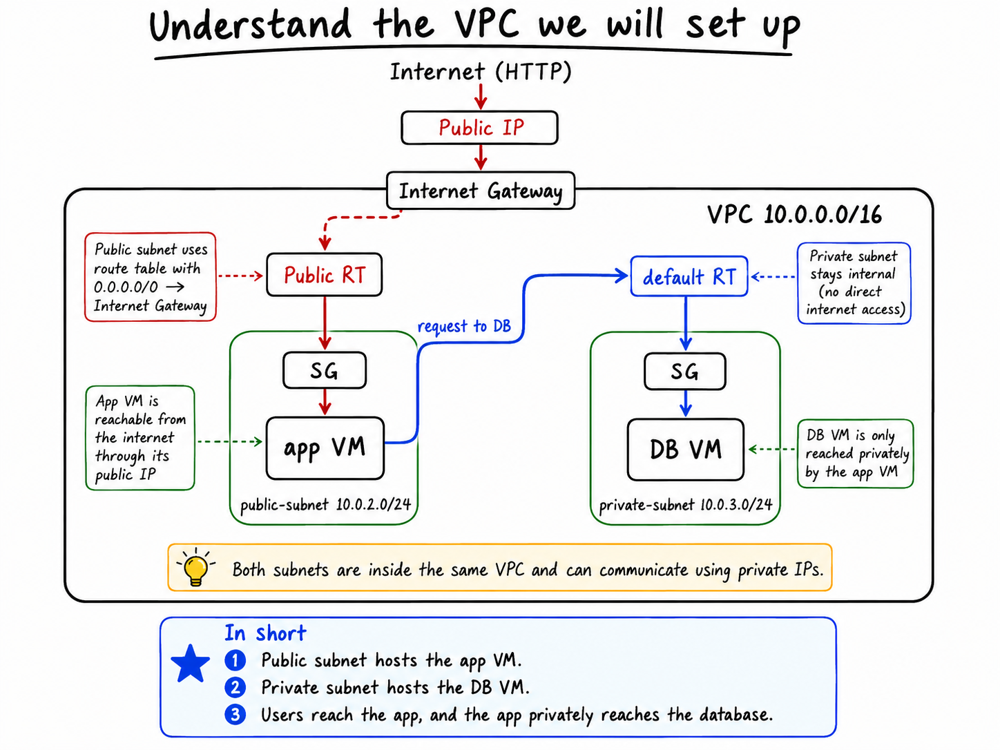
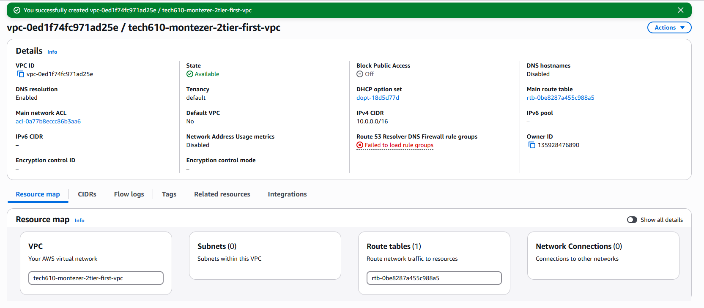
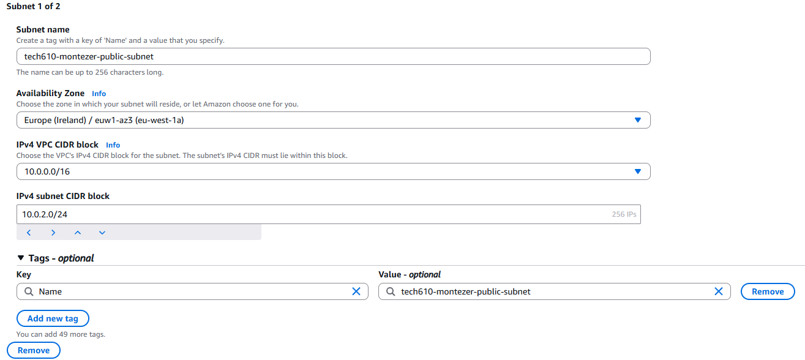
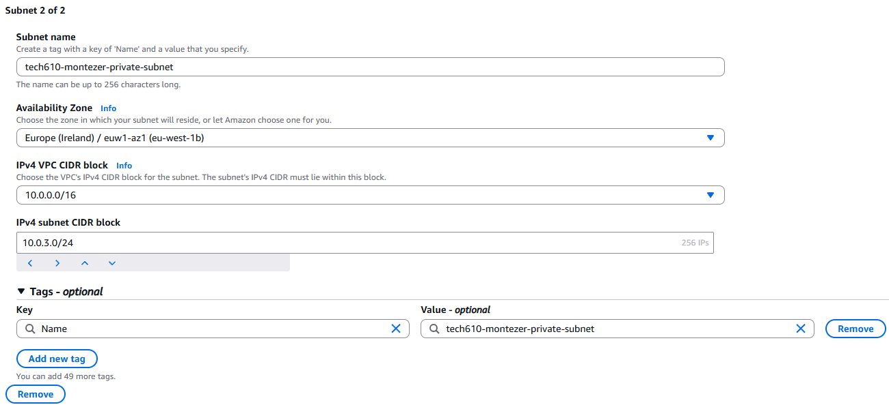
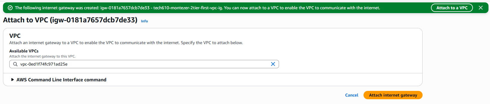
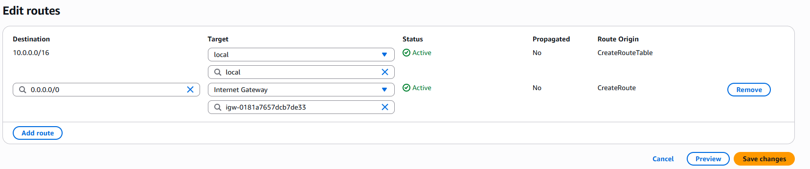
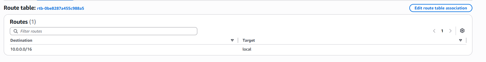
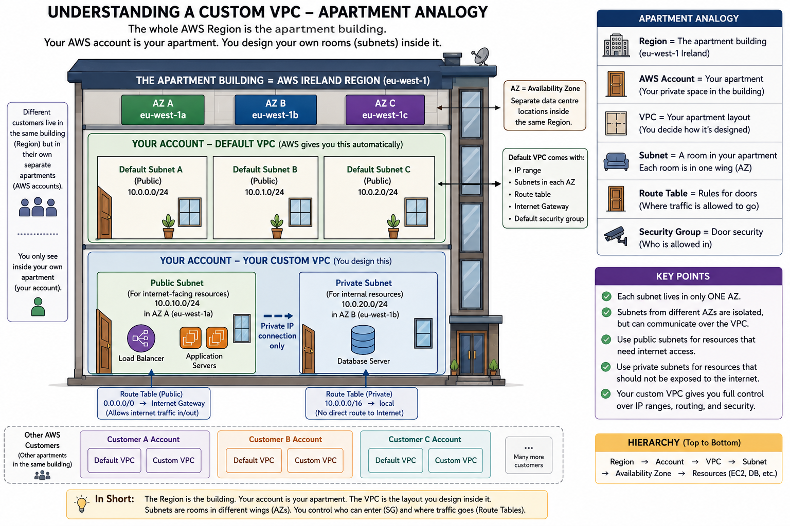

# AWS Custom VPC – Two-Tier Deployment

- [AWS Custom VPC – Two-Tier Deployment](#aws-custom-vpc--two-tier-deployment)
  - [Project overview](#project-overview)
- [Plan](#plan)
  - [Planned architecture](#planned-architecture)
  - [Planned steps](#planned-steps)
- [Implementation](#implementation)
  - [1. Created the custom VPC](#1-created-the-custom-vpc)
  - [2. Created the public subnet](#2-created-the-public-subnet)
  - [3. Created the private subnet](#3-created-the-private-subnet)
  - [4. Created and attached an Internet Gateway](#4-created-and-attached-an-internet-gateway)
  - [5. Configured the public route table](#5-configured-the-public-route-table)
  - [6. Kept the database subnet private](#6-kept-the-database-subnet-private)
  - [7. Created the security groups](#7-created-the-security-groups)
    - [Application security group](#application-security-group)
    - [Database security group](#database-security-group)
  - [8. Launched the database VM](#8-launched-the-database-vm)
  - [9. Launched the application VM](#9-launched-the-application-vm)
- [Result](#result)
- [MVP and future iterations](#mvp-and-future-iterations)
- [Supporting VPC analogy](#supporting-vpc-analogy)


## Project overview

This project documents the creation of a custom AWS VPC for a simple two-tier application.

The architecture contains:

- A custom VPC
- A public subnet for the application VM
- A private subnet for the database VM
- An Internet Gateway
- A public route table
- A private route table
- Separate security groups for the app and database
- My own application and database AMIs

The purpose of the task was mainly to understand how a custom VPC is designed and how public and private resources are separated.

---

# Plan

## Planned architecture



The application VM is placed in the public subnet because users need to access it through the internet.

The database VM is placed in the private subnet because it should not be directly accessible from the internet.

Both subnets are inside the same VPC, so the application can communicate with the database using its private IP address.

## Planned steps

1. Create a custom VPC with the CIDR block `10.0.0.0/16`.
2. Create a public subnet with the CIDR block `10.0.2.0/24`.
3. Create a private subnet with the CIDR block `10.0.3.0/24`.
4. Create an Internet Gateway and attach it to the VPC.
5. Create a public route table.
6. Add a route from `0.0.0.0/0` to the Internet Gateway.
7. Associate the public route table with the public subnet.
8. Keep the private subnet on a route table with only the local VPC route.
9. Create a security group for the application VM.
10. Create a security group for the database VM.
11. Launch the database VM from my DB AMI in the private subnet.
12. Launch the application VM from my App AMI in the public subnet.
13. Configure the application to use the database VM's private IP.
14. Confirm that the application works.

---

# Implementation

## 1. Created the custom VPC

I created a custom VPC named:

```text
tech610-montezer-2tier-first-vpc
```

The VPC uses the following IPv4 CIDR block:

```text
10.0.0.0/16
```



The screenshot shows that the VPC was created successfully and is in the `Available` state.

---

## 2. Created the public subnet

I created a public subnet using:

```text
Name: tech610-montezer-public-subnet
CIDR block: 10.0.2.0/24
Availability Zone: eu-west-1a
```



This subnet is used for the application VM because the application needs to be reachable from the internet.

---

## 3. Created the private subnet

I created a second subnet for the database using:

```text
Name: tech610-montezer-private-subnet
CIDR block: 10.0.3.0/24
Availability Zone: eu-west-1b
```



This subnet is private and is used for the database VM. The database is not directly exposed to the internet.

---

## 4. Created and attached an Internet Gateway

I created an Internet Gateway and attached it to my custom VPC.



The Internet Gateway provides a path between the internet and resources inside the public subnet.

---

## 5. Configured the public route table

I created a public route table and added the following routes:

```text
10.0.0.0/16 → local
0.0.0.0/0 → Internet Gateway
```



The `0.0.0.0/0` route sends internet traffic through the Internet Gateway.

The public route table was associated with the public subnet.

---

## 6. Kept the database subnet private

The private route table contains only the local route:

```text
10.0.0.0/16 → local
```



Because it has no route to the Internet Gateway, resources in the private subnet are not directly accessible from the internet.

The local route still allows communication between resources inside the same VPC.

---

## 7. Created the security groups

I created separate security groups for the application and database VMs.

### Application security group

The application security group allows:

- SSH on port `22` from My IP
- HTTP on port `80` from the internet

### Database security group

The database security group allows:

- MongoDB traffic on port `27017` from the public application subnet

This means users can access the application, but they cannot directly access the database.

---

## 8. Launched the database VM

I launched the database VM using my own DB AMI.

The instance was placed in:

```text
VPC: tech610-montezer-2tier-first-vpc
Subnet: tech610-montezer-private-subnet
Public IP: Disabled
```

The database VM only has a private IP address and is used by the application VM.

---

## 9. Launched the application VM

I launched the application VM using my own App AMI.

The instance was placed in:

```text
VPC: tech610-montezer-2tier-first-vpc
Subnet: tech610-montezer-public-subnet
Auto-assign public IP: Enabled
```

The database private IP was passed to the application through user data:

```bash
#!/bin/bash

export MONGODB_URI=mongodb://<DB_PRIVATE_IP>:27017/tictactoe

cd /home/ubuntu/tech610-tic-tac-toe/app

pm2 start index.js --name tic
```

This allows the public application VM to communicate privately with the database VM.

---

# Result

The custom VPC was successfully created with:

- One public application subnet
- One private database subnet
- An Internet Gateway
- Separate public and private routing
- Separate security groups
- An application VM created from my App AMI
- A database VM created from my DB AMI

The application VM is accessible from the internet, while the database remains private.

---

# MVP and future iterations

The MVP focused on creating a working two-tier architecture inside a custom VPC.

Possible future improvements include:

- Using the application security group as the source for the database security group
- Adding a second public subnet in another Availability Zone
- Adding a load balancer
- Adding an Auto Scaling Group
- Adding monitoring with CloudWatch

---

# Supporting VPC analogy



The Region can be compared to an apartment building, the VPC to an apartment layout, and the subnets to separate rooms.

The route tables decide where network traffic can travel, while security groups control which traffic is allowed to enter each resource.
